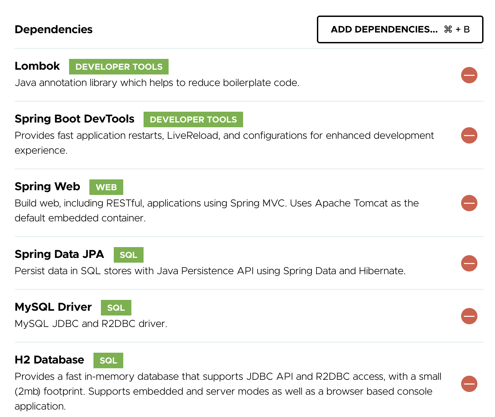
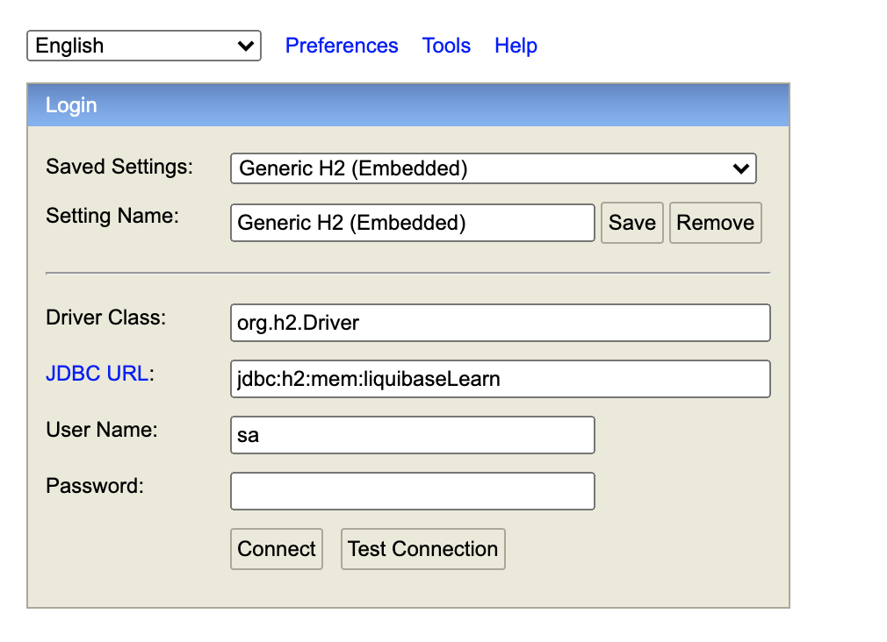

# liquibase-with-sprintBoot

## Swagger UI
http://localhost:9999/swagger-ui/index.html

Begin with project with the following dependencies


### Scenario 1 : 
Create tables using change log and insert sample data. Tables should have Primary keys and have foreign key relationship  

Create the Tables (via Liquibase Change Set) after creating the following schema from SQL Prompt

##### __Branch : v1-create-table-inserting-data__

```sql
CREATE SCHEMA `liquibaseLearn`;

CREATE USER 'nitin'@'localhost' IDENTIFIED BY 'E@syP@$$';

GRANT SELECT, INSERT, UPDATE, DELETE, EXECUTE, SHOW VIEW, CREATE, ALTER, REFERENCES, INDEX, CREATE VIEW, CREATE ROUTINE,
	ALTER ROUTINE, EVENT, DROP, TRIGGER ON `liquibaseLearn`.* TO 'nitin'@'localhost';
FLUSH PRIVILEGES;
```

### Scenario 2 : 
Automate the Liquibase execution at Application boot time.

Implement REST API, allow MySQL and H2 Db connection, Controlled by application yml profile. Add the Liquibase dependency, 
have the changelog.xml path added in the main profile so that both mySql and H2DB can be initialized.

Access :

http://localhost:9999/h2-console


### Scenario 3 :
Implement a DB change by having a new column, gender, added in the profiles table.
